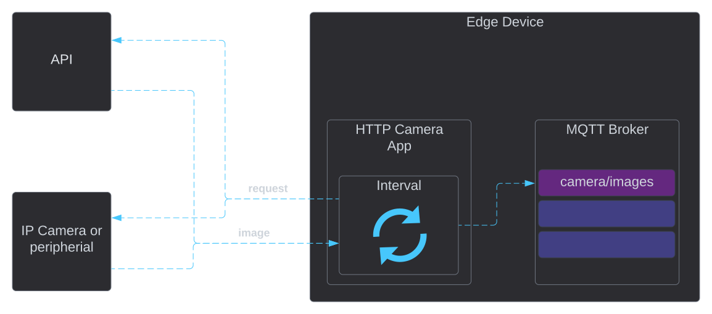

# HTTP camera App
The camera app collect images from cameras over http/api.

{ width="800" }

## Features

The most simple app to ingest images into a message stream with a fixed interval. The app calls a http(s) API that 
provide a binary JPEG image response.

### Start streaming images

Define the source of the images, a BASE_URL, example from Axis IP camera looks like this:
```url
http://192.168.1.137/axis-cgi/jpg/image.cgi?resolution=640x480
```
__this might not work for all Axis cameras__
a Bosch IP camera example:
```url
http://192.168.0.186/snap.jpg?JpegSize=L
```
__this might not work for all Bosh cameras__

!!! note

You have to specify IP and resolution setting that match your application.

### Basic Auth support

The HTTP Camera App support Basic Auth for calling IP cameras or APIs. So have credentials ready to fill in `USERNAME` 
and `PASSWORD`.

There are variations of Basic Auth, basic or disgest, sometimes called Digest Auth. Specify AUTH_TYPE accordingly.

### Output

Output can be sent to the MQTT Broker on a custom topic. The topic is set by the variable `MQTT_OUT_0`.

#### MQTT Message Format

The message format only has one JSON element called payload, that contain the image data. The image is encoded with MIME, 
base64 encoding for the JPEG image. This is the default for most image generating apps from Teknoir.

This example is truncated and does not show the full MIME image data:
```json
{
  "payload": "data:image/jpeg;base64,/9j/4AAQSkZJRgABAgAAAQABAAD/4QErRXhpZgAASUkqAAgAAAAFAA8BAgAFAAAASgAAABABAgAGAAAA..."
}
```

## Settings

| Var                  | Description                              | Default                  |
|----------------------|------------------------------------------|--------------------------|
| `MQTT_SERVICE_HOST`  | MQTT Broker Host                         | mqtt.kube-system         |
| `MQTT_SERVICE_PORT`  | MQTT Broker Port                         | 1883                     |
| `UPDATE_INTERVAL`    | Milliseconds between update              | 1000                     |
| `MQTT_OUT_0`         | The MQTT topic to publish images to      | camera/images            |
| `BASE_URL`           | The url to the camera image to capture   | http://localhost/capture |
| `AUTH_TYPE`          | The auth type can be `digest` or `basic` | digest                   |
| `USERNAME`           | The auth username                        | root                     |
| `PASSWORD`           | The auth password      Delete resource   | teknoir                  |

## Advanced

The Kubernetes deployment for this app can look like this:

```yaml
apiVersion: apps/v1
kind: Deployment
metadata:
  name: camera
spec:
  replicas: 1
  selector:
    matchLabels:
      app: camera
  template:
    metadata:
      labels:
        app: camera
    spec:
      containers:
        - name: camera
          image: gcr.io/teknoir/camera-http:latest-master
          imagePullPolicy: IfNotPresent
          env:
            - name: MQTT_SERVICE_HOST
              value: "mqtt.kube-system"
            - name: MQTT_SERVICE_PORT
              value: "1883"
            - name: MQTT_OUT_0
              value: "camera/images"
            - name: UPDATE_INTERVAL
              value: "5000"
            - name: BASE_URL
              value: "http://192.168.0.186/snap.jpg?JpegSize=L"
            - name: AUTH_TYPE
              value: "digest"
            - name: USERNAME
              value: "username"
            - name: PASSWORD
              value: "password"
```
